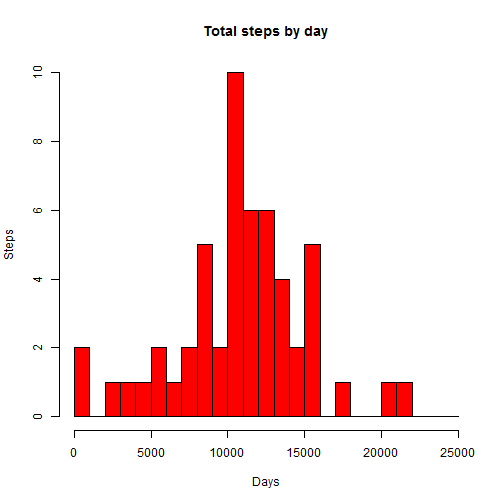

PA1_template
==============

Peer Assignment 1

First, I'm going to load some data.


```r
activity <- read.csv("F:/R/repdata-data-activity/activity.csv")

library(lattice)
library(ggplot2)
```

For future processing, I'm going to convert the data type


```r
activity$date<- as.Date(activity$date)
```

Part 1: first use aggregate function to organize by date, and plot it out


```r
sumsteps<- aggregate(steps~ date, data=activity, sum, na.rm=TRUE)

hist(sumsteps$steps,breaks=seq(from=0, to=25000, by=1000), main="Total steps by day", xlab="Days", ylab="Steps",col="red")
```

 

Second, calculate the mean and median


```r
mean(sumsteps$steps)
```

```
## [1] 10766.19
```

```r
median(sumsteps$steps)
```

```
## [1] 10765
```

Part2: firstly, aggregate the data by applying mean function


```r
AverageSteps<- aggregate(steps~ interval, data=activity, mean, na.rm=TRUE)
```

Second, plot the daily activity pattern

```r
plot(AverageSteps$interval, AverageSteps$steps, type="l", xlab="interval", ylab="average steps", main="Average Number of Steps", col="blue")
```

 

Third, find the maximum

```r
AverageSteps$interval[which.max(AverageSteps$steps)]
```

```
## [1] 835
```

Part 3: first, calculate the total numbers of missing values

```r
sum(!complete.cases(activity))
```

```
## [1] 2304
```

Second, replace the NA by mean in 5-min interval

```r
StepsAverage<- aggregate(steps~ interval, data=activity, FUN= mean)
fillNA<- numeric()
for (i in 1:nrow(activity)) {
  obs <- activity[i, ]
  if (is.na(obs$steps)) {
    steps <- subset(StepsAverage, interval == obs$interval)$steps
  } else {
    steps <- obs$steps
  }
  fillNA <- c(fillNA, steps)
}
```

Third, create a new dataset equal to original but with the missing data filled in

```r
activityNew<- activity
activityNew$steps<- fillNA
```

Next, plot the total number of steps by day

```r
sumsteps2<- aggregate(steps~ date, data=activityNew, sum, na.rm=TRUE)

hist(sumsteps2$steps, breaks=seq(from=0, to=25000, by=1000), xlab="Days", ylab="Steps", main="Total steps by day", col="red")
```

 

Finally, calculate the mean and median

```r
mean(sumsteps2$steps)
```

```
## [1] 10766.19
```

```r
median(sumsteps2$steps)
```

```
## [1] 10766.19
```

Part4, firstly convert to weekdays and weekends

```r
activityNew$day <- ifelse(weekdays(activityNew$date) %in% c("Saturday", "Sunday"),'weekend','weekday')
```

Secondly, aggregate steps by date

```r
stepsByDate<- aggregate(steps~ interval+day, activityNew, FUN="mean")
```

panel plot across all weekdays or weekend days

```r
xyplot(steps ~ interval | day, stepsByDate, type = "l", layout = c(1, 2), xlab = "Interval", ylab = "Number of steps", col="blue")
```

 
